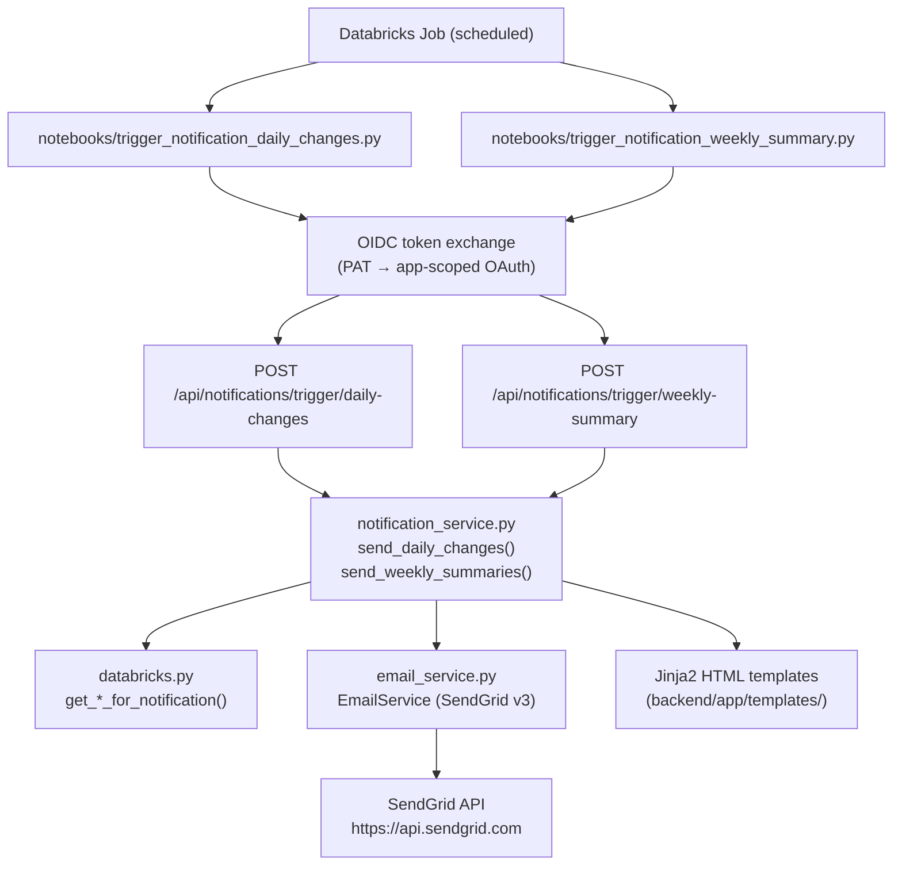

# Iona CSM — Email Notification System

This document is the single reference for the email notification feature. It covers architecture, file ownership, API parameters, delivery modes, auth, deployment, and testing. See [DEPLOYMENT.md](../DEPLOYMENT.md) for general secrets/config setup.

---

## Table of contents

1. [Overview](#overview)
2. [Architecture](#architecture)
3. [File structure](#file-structure)
4. [Delivery modes](#delivery-modes)
5. [API reference](#api-reference)
6. [Recipient management](#recipient-management)
7. [Opt-out preferences](#opt-out-preferences)
8. [Databricks Apps auth (OIDC)](#databricks-apps-auth-oidc)
9. [Deploying changes](#deploying-changes)
10. [Email templates](#email-templates)
11. [Operational testing checklist](#operational-testing-checklist)
12. [Troubleshooting](#troubleshooting)

---

## Overview

Two recurring email campaigns run on a Databricks Jobs schedule:

| Campaign | Trigger | What it sends |
|---|---|---|
| **Daily changes** | After `compute_health_scores` (daily) | One digest per CSM listing accounts with health changes, new urgent tickets, usage drops, Gong signals, and approaching renewals |
| **Weekly summary** | After `compute_weekly_summaries` (Monday) | Account narratives, health scores, Gong summaries — in one of three delivery modes (see below) |

In **production**, mail goes to real CSM recipients derived from Databricks. In **test mode** (`test_recipient` query param), all mail is redirected to one or more `*@ifs.com` addresses and no real users are contacted.

---

## Architecture



The OIDC step is required because Databricks Apps (`*.databricksapps.com`) reject raw workspace PATs — only app-scoped OAuth tokens are accepted. See [Databricks Apps auth (OIDC)](#databricks-apps-auth-oidc).

---

## File structure

All notification-relevant files are listed below. Do not edit files outside this table without understanding their broader impact.

| Area | File | Purpose |
|---|---|---|
| HTTP API | [`backend/app/api/notifications.py`](../backend/app/api/notifications.py) | FastAPI router: trigger endpoints, recipient CRUD, preference-key listing |
| Orchestration | [`backend/app/services/notification_service.py`](../backend/app/services/notification_service.py) | Fetches data, builds template contexts, dispatches email for each delivery mode |
| Email transport | [`backend/app/services/email_service.py`](../backend/app/services/email_service.py) | SendGrid v3 HTTP client with retry logic (`EmailService`, `EmailMessage`, `SendResult`) |
| SQL / data | [`backend/app/services/databricks.py`](../backend/app/services/databricks.py) | Notification-specific query methods (see list below) |
| Schemas | [`backend/app/models/schemas.py`](../backend/app/models/schemas.py) | `TriggerEmailResponse`, `NotificationRecipient*`, `TestEmailRequest` |
| Base template | [`backend/app/templates/base.html`](../backend/app/templates/base.html) | Shared layout, CSS classes (`.badge-*`, `.card`, `.kpi-*`, score bars) |
| Health macros | [`backend/app/templates/_email_health_macros.html`](../backend/app/templates/_email_health_macros.html) | Jinja2 macros: `health_badge()`, `health_color()`, `health_tint()`, `health_border()` |
| Daily template | [`backend/app/templates/daily_changes.html`](../backend/app/templates/daily_changes.html) | Daily change digest email |
| Weekly (per account) | [`backend/app/templates/weekly_summary.html`](../backend/app/templates/weekly_summary.html) | Single account weekly summary |
| Weekly (CSM digest) | [`backend/app/templates/weekly_summary_csm_digest.html`](../backend/app/templates/weekly_summary_csm_digest.html) | Portfolio view: all of a CSM's accounts in one email |
| Weekly (dept digest) | [`backend/app/templates/weekly_summary_department_digest.html`](../backend/app/templates/weekly_summary_department_digest.html) | Leadership view: accounts grouped by CSM department |
| Test email | [`backend/app/templates/test_email.html`](../backend/app/templates/test_email.html) | SendGrid integration smoke-test |
| Daily notebook | [`notebooks/trigger_notification_daily_changes.py`](../notebooks/trigger_notification_daily_changes.py) | Databricks notebook that calls the daily trigger endpoint |
| Weekly notebook | [`notebooks/trigger_notification_weekly_summary.py`](../notebooks/trigger_notification_weekly_summary.py) | Databricks notebook that calls the weekly trigger endpoint |

### Notification-specific methods in `databricks.py`

These are the only methods in the large `DatabricksService` class that the notification pipeline calls:

| Method | Used by |
|---|---|
| `get_accounts_with_csm_emails()` | Both campaigns — maps `account_id` to CSM email/name/department |
| `get_weekly_summaries_for_notification(week_start)` | Weekly — fetches narrative + Gong summaries |
| `get_latest_health_scores_for_notification()` | Weekly — current score/category/ARR/renewal per account |
| `get_health_score_changes_for_notification()` | Daily — accounts with score or category changes |
| `get_support_changes_for_notification()` | Daily — new Urgent/High tickets today |
| `get_pendo_usage_changes_for_notification()` | Daily — accounts with >30% visitor drop vs 7-day avg |
| `get_gong_changes_for_notification()` | Daily — new calls, risk tracker hits, no-meeting warnings |
| `get_renewal_alerts_for_notification()` | Daily — accounts entering 30/60/90-day renewal windows |
| `get_user_notification_preferences(email)` | Both — per-user opt-out map |
| `get_notification_recipients(...)` | Both — global recipients list (non-CSM subscribers) |
| `ensure_notification_recipients_table()` | Recipient CRUD — creates table on first write |
| `create/update/delete_notification_recipient(...)` | Recipient CRUD |

---

## Delivery modes

### Weekly summary — three modes

| Mode | `weekly_delivery` value | Who receives mail (production) | Who receives mail (test mode) |
|---|---|---|---|
| **Per account** (default) | `per_account` | One email per account → CSM owner + global `receive_all_weekly` subscribers | Each `test_recipient` address receives all emails (use `test_single_account=true` to limit to one sample) |
| **Per CSM portfolio** | `per_csm` | One portfolio digest per CSM with all their accounts | One combined email (all CSMs merged) → each `test_recipient` |
| **Department digest** | `department_digest` | One email per `digest_recipients` address, all accounts grouped by CSM department | Same body → each `test_recipient` address (ignores `digest_recipients`) |

### Daily changes

There is only one delivery mode. In production, each CSM receives a digest of changes across their own accounts, plus any global `receive_all_daily` subscribers get all changed accounts. In test mode, the full change digest goes to each `test_recipient`.

### Health status colour coding (all emails)

All templates import `_email_health_macros.html` for consistent inline-styled badges and tints that survive email clients stripping `<style>` blocks.

| Category | Badge colour | Score colour | Card tint |
|---|---|---|---|
| Good | Green (`#d1fae5` bg / `#065f46` text) | `#10b981` | `#ecfdf5` |
| At Risk | Amber (`#fef3c7` bg / `#92400e` text) | `#d97706` | `#fffbeb` |
| Critical / Unknown / other | Red (`#fee2e2` bg / `#991b1b` text) | `#dc2626` | `#fef2f2` |

---

## API reference

Base path: `POST https://<app-url>/api/notifications/`

### `POST /trigger/daily-changes`

Detects today's changes and sends digest emails.

| Parameter | Type | Default | Description |
|---|---|---|---|
| `test_recipient` | string | — | One or more `*@ifs.com` addresses (comma or semicolon separated). Redirects all mail to these addresses; no real users are contacted. |

**Response:** `TriggerEmailResponse`

```json
{
  "success": true,
  "emails_sent": 3,
  "emails_failed": 0,
  "skipped": 1,
  "errors": [],
  "detail": "Detected changes in 12 accounts, notified 3 recipients",
  "test_mode": false,
  "test_recipient": null
}
```

When `test_mode` is true, `test_recipient` echoes the comma-joined list of test addresses.

### `POST /trigger/weekly-summary`

| Parameter | Type | Default | Description |
|---|---|---|---|
| `weekly_delivery` | string | `per_account` | `per_account`, `per_csm`, or `department_digest` |
| `week_start` | string | latest in table | ISO date (`YYYY-MM-DD`) for the week to send |
| `test_recipient` | string | — | One or more `*@ifs.com` (comma or semicolon separated). Overrides real recipients. |
| `digest_recipients` | string | — | Comma-separated `*@ifs.com` list. Required for `department_digest` when not in test mode. Semicolons are **not** supported here (comma only). |
| `test_single_account` | bool | `false` | With `test_recipient` + `per_account` only: send one sample email instead of one per account. |
| `test_account_pick` | string | `first` | `first` (alphabetical) or `random`. Only applied when `test_single_account=true`. |

**Validation:**

- `test_recipient` must be `*@ifs.com` for every entry; non-IFS addresses return HTTP 400.
- `digest_recipients` has no domain validation in code — use only real IFS addresses.
- `test_account_pick` must be `first` or `random`; anything else returns HTTP 400.

### `POST /test-email`

Request body:

```json
{ "to_email": "you@ifs.com", "to_name": "Optional Name" }
```

Sends a single smoke-test email. Does not require `test_recipient`; the body address is used directly.

---

## Recipient management

Global recipients (non-CSMs who receive all daily/weekly mail) are stored in a Databricks Delta table managed by the following endpoints:

| Method | Path | Description |
|---|---|---|
| GET | `/api/notifications/recipients` | List all (filter by `active_only`, `receive_all_weekly`, `receive_all_daily`) |
| POST | `/api/notifications/recipients` | Add a recipient (`user_email`, `user_name`, `role`, `receive_all_weekly`, `receive_all_daily`) |
| PUT | `/api/notifications/recipients/{email}` | Update a recipient |
| DELETE | `/api/notifications/recipients/{email}` | Remove a recipient |

There is no UI for this yet. Use the OpenAPI explorer at `/api/docs` (development) or `curl`/Postman in production.

---

## Opt-out preferences

Individual users (CSMs) can disable specific notification categories. Keys are set via `PUT /api/preferences/{key}` with body `{"value": "disabled"}`. All keys default to `enabled`.

| Preference key | What it disables |
|---|---|
| `notification.weekly_summary` | Weekly account summary emails |
| `notification.daily_health` | Daily health score change alerts |
| `notification.daily_support` | Daily urgent/high ticket alerts |
| `notification.daily_usage` | Daily Pendo usage drop alerts |
| `notification.daily_gong` | Daily Gong call / risk signal alerts |
| `notification.daily_renewal` | Daily renewal proximity alerts |

List all available keys: `GET /api/notifications/preference-keys`

---

## Databricks Apps auth (OIDC)

Databricks Apps reject raw workspace PATs. The trigger notebooks perform an OIDC token exchange before calling the app:

```
workspace PAT → POST {workspace}/oidc/v1/token → app-scoped OAuth token
```

The audience for the exchange is the app's `oauth2_app_client_id`, fetched at runtime via `databricks.sdk.WorkspaceClient.apps.get(app_name)`.

**PAT source resolution order (both notebooks):**

1. `DATABRICKS_TOKEN` or `TOKEN` environment variable
2. `dbutils.notebook.getContext().apiToken()` (classic clusters only; fails on Serverless)
3. Databricks secret: `iona` scope / `IONA_APP_HTTP_PAT` key (recommended for Serverless)
4. Custom secret: `IONA_HTTP_AUTH_SECRET_SCOPE` / `IONA_HTTP_AUTH_SECRET_KEY` widgets

**Recommended setup for Serverless jobs:**

```bash
databricks secrets put-secret iona IONA_APP_HTTP_PAT --string-value <workspace-PAT>
```

The PAT user must have permission to access the `iona-cx` app. The `databricks-sdk` package must be installed in the notebook cluster (`%pip install databricks-sdk`).

---

## Deploying changes

After editing any backend file (templates, services, API), run these three commands from the repo root in order:

```bash
# 1. Rebuild the React SPA into backend/static
cd frontend
npm run build:prod

# 2. Upload the bundle (syncs all backend/ source to the workspace)
cd ../backend
databricks bundle deploy

# 3. Create a new app deployment and restart the runtime
databricks apps deploy --target prod --skip-validation
```

The CLI uses the bundle config in [`backend/databricks.yml`](../backend/databricks.yml) which points to the `iona-cx` app and the `dbc-97a2feb3-3e52` workspace.

**Note:** `databricks apps deploy --source-code-path ./backend` does **not** work with the current CLI because `--source-code-path` expects a workspace path, not a local folder. Use the project-mode deploy above from inside `backend/`.

After deploy, the app is available at:
`https://iona-cx-1057997375544232.aws.databricksapps.com`

---

## Email templates

Templates live in `backend/app/templates/` and are rendered by Jinja2. All extend `base.html` and import `_email_health_macros.html`.

### Health macros (`_email_health_macros.html`)

Four macros are available. Import them at the top of any template that needs them:

```jinja

```

| Macro | Returns | Example use |
|---|---|---|
| `health_badge(category)` | Full `<span>` with inline styles + CSS classes | Status pill in account header |
| `health_color(category)` | Saturated hex string | Score number colour |
| `health_tint(category)` | Light pastel hex string | Card/row background |
| `health_border(category)` | Medium hex string | 4–6 px left accent stripe |

Inline styles are duplicated alongside CSS classes so badges render correctly in Outlook and Gmail dark mode, which strip `<style>` blocks.

### Template context variables

**`daily_changes.html`**

| Variable | Type | Description |
|---|---|---|
| `report_date` | string | Formatted date string |
| `total_accounts` | int | Number of accounts with changes |
| `accounts` | list | Each item: `account_id`, `account_name`, `current_category`, `health_changes`, `support_changes`, `usage_changes`, `gong_changes`, `renewal_alerts` |

**`weekly_summary.html`** (per-account)

| Variable | Type | Description |
|---|---|---|
| `account_name` | string | |
| `week_start` / `week_end` | string | |
| `narrative` | string | AI-generated weekly narrative |
| `gong_summary` | string | Gong call summary |
| `health_score` | int | 0–100 |
| `health_category` | string | `Good`, `At Risk`, or other (treated as critical) |
| `renewal_days` | int or None | Days to nearest renewal |
| `total_arr` | float or None | Account ARR |

**`weekly_summary_csm_digest.html`** (per-CSM portfolio)

| Variable | Type | Description |
|---|---|---|
| `csm_name` | string | |
| `week_start` / `week_end` | string | |
| `accounts` | list | Each item has same fields as single weekly template |
| `test_mode` | bool | Adds [TEST MODE] label |

**`weekly_summary_department_digest.html`** (department rollup)

| Variable | Type | Description |
|---|---|---|
| `week_start` / `week_end` | string | |
| `total_accounts` | int | |
| `good_count` / `at_risk_count` / `critical_count` | int | Overall KPIs |
| `departments` | list | Each: `{"name": str, "accounts": [...]}` |
| `test_mode` | bool | |

---

## Operational testing checklist

Run these in order when validating a fresh deployment or after a change:

1. **Smoke test** — `POST /api/notifications/test-email` with `{"to_email": "you@ifs.com"}`. Confirms SendGrid key and template rendering are working.

2. **Daily — test mode** — Run `trigger_notification_daily_changes` with `IONA_NOTIFICATION_TEST_RECIPIENT=you@ifs.com`. Expect one combined digest email with all accounts that have changes today. If no changes exist, the run exits cleanly with `"detail": "No changes detected"` (not a failure).

3. **Weekly per_account — test mode** — Run `trigger_notification_weekly_summary` with `IONA_NOTIFICATION_TEST_RECIPIENT=you@ifs.com`, delivery `per_account`, and `IONA_NOTIFICATION_TEST_SINGLE_ACCOUNT=true`. Expect one sample weekly summary email.

4. **Weekly per_csm — test mode** — Same notebook, delivery `per_csm`. Expect one portfolio digest email listing all accounts across all CSMs.

5. **Weekly department_digest — test mode** — Same notebook, delivery `department_digest`, `IONA_NOTIFICATION_TEST_RECIPIENT=you@ifs.com`. Expect one department-grouped digest. (In production, provide `IONA_NOTIFICATION_DIGEST_RECIPIENTS` instead and omit `TEST_RECIPIENT`.)

6. **Multi-recipient test** — Set `IONA_NOTIFICATION_TEST_RECIPIENT=alice@ifs.com,bob@ifs.com`. Both addresses should receive the same email.

---

## Troubleshooting

| Symptom | Likely cause | Fix |
|---|---|---|
| HTTP 401 from notebook | Raw PAT used instead of OIDC token | Confirm `_get_app_api_bearer_token()` is called; check `iona/IONA_APP_HTTP_PAT` secret exists |
| HTTP 404 from notebook | App deployment is older than current API code | Re-run `databricks bundle deploy` + `databricks apps deploy` |
| HTTP 400 `test_recipient must be a valid *@ifs.com` | Non-IFS address in `test_recipient` | Use only `*@ifs.com` addresses |
| HTTP 400 `digest_recipients is required` | `department_digest` mode without recipients and no `test_recipient` | Add `IONA_NOTIFICATION_DIGEST_RECIPIENTS` or set `TEST_RECIPIENT` |
| No email, `success: true`, `emails_sent: 0` | No data for today (no health changes, no summaries for chosen week) | Normal — verify data exists in Databricks; check `detail` field for clue |
| Email arrives but badges are all grey | Email client stripping `<style>` blocks | Templates already use inline styles via `_email_health_macros.html`; check that the latest deploy included the new templates |
| `databricks-sdk` not found in notebook | Package missing from cluster | Add `%pip install databricks-sdk` at top of notebook cell, or to cluster init |
